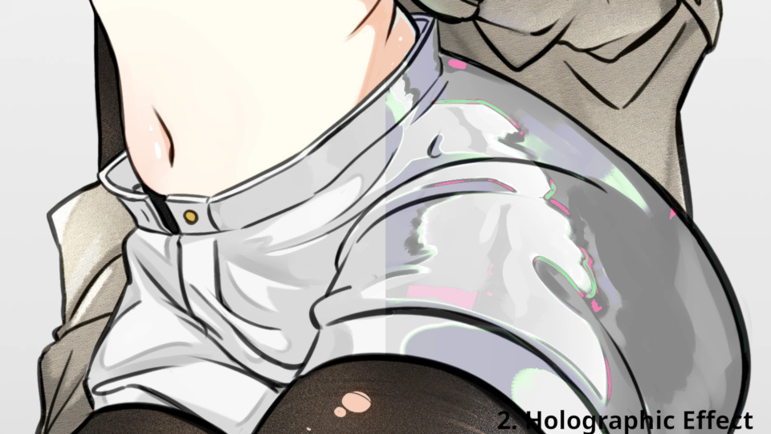

# Soulless GEGL <sub><sup>🟥🟩🟦</sup></sub>

A collection of GEGL GIMP plugins made by me.

## How to install

Download the pack for [Linux](https://github.com/soulless-tree/soulless-gegl/releases/download/v0.1.1/soulless-gegl-v0.1.1-linux.zip) (v0.1.1) or [Windows](https://github.com/soulless-tree/soulless-gegl/releases/download/v0.1.0/soulless-gegl-v0.1.0-windows.zip) (v0.1.0) and paste the files into your GEGL plugins folder:

Linux
```
~/.local/share/gegl-0.4/plug-ins/
```

Windows
```
C:\Users\USERNAME\AppData\Local\gegl-0.4\plug-ins
```

## Plugin list
  
<picture></picture><picture></picture>

